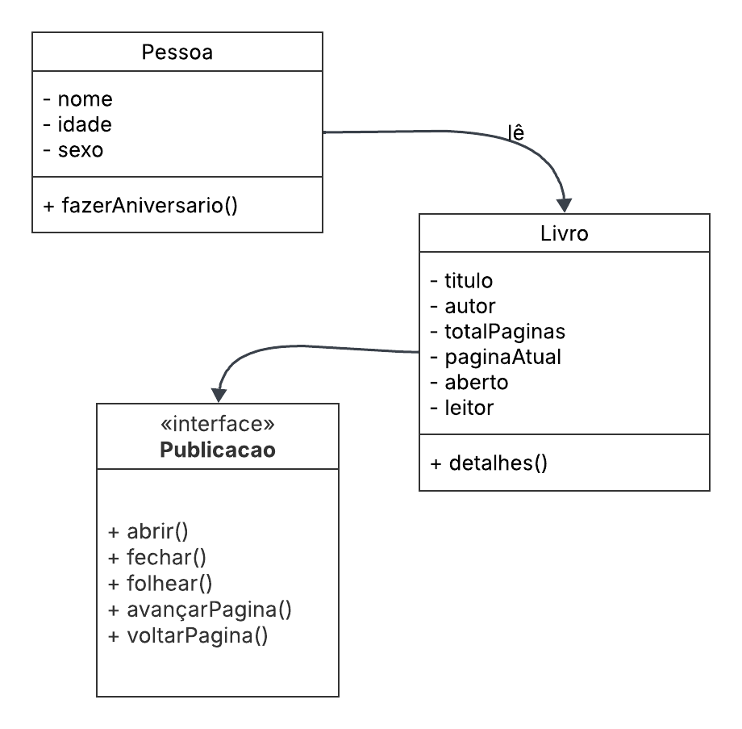

# Projeto em C++ POO

## Realizei um código simples em C++ para entender um pouco mais de POO referente e disciplina de Estrutura de Dados da faculdade

### Sobre o Código:
O diagrama usado é de um projeto que fiz em Java. Temos as Classes Pessoa e Livro, além disso temos a Interface Publicacao. A classe Livro tem um relacionamento com a classe Pessoa, indicado pela seta rotulada "lê", sugerindo que uma pessoa pode ler um livro. Isso é representado pelo atributo leitor na classe Livro, que é uma instância da classe Pessoa.

